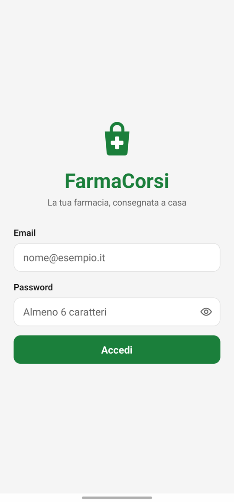
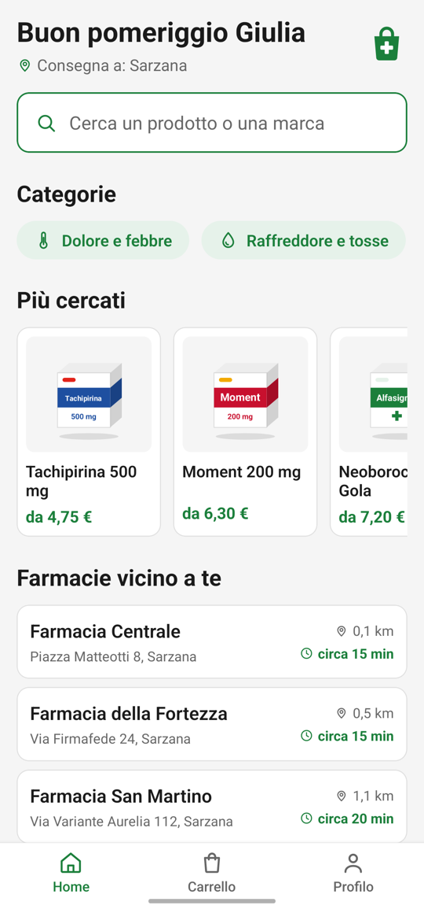
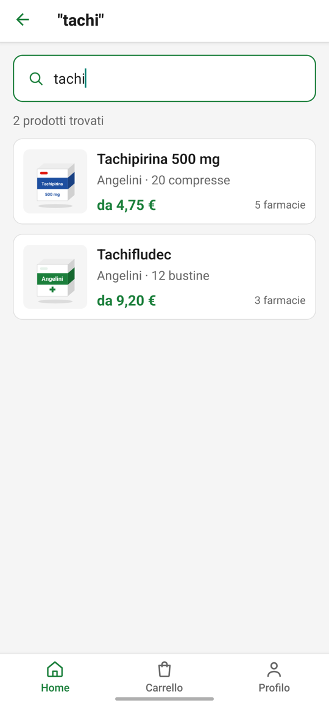
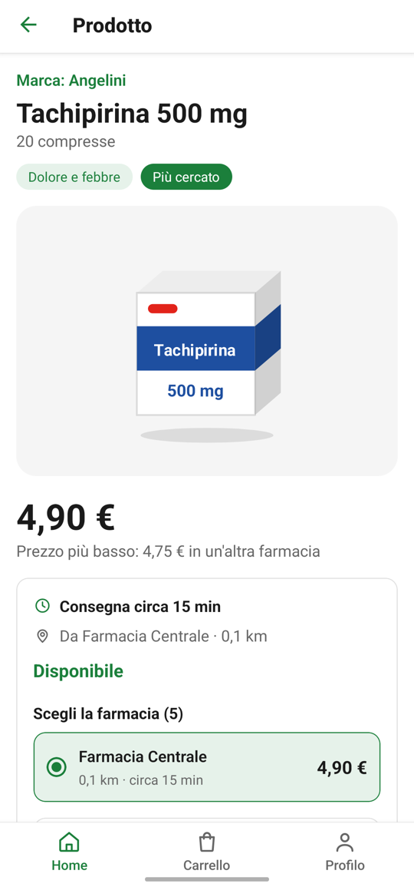
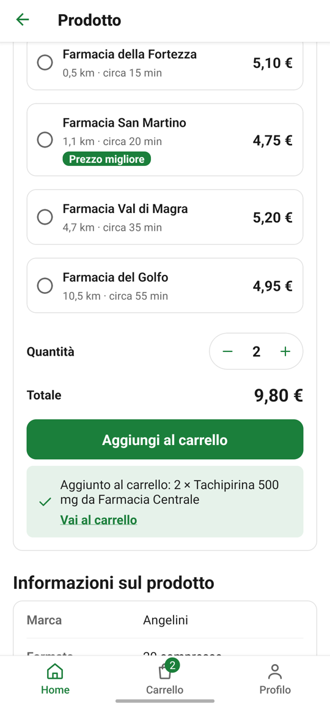
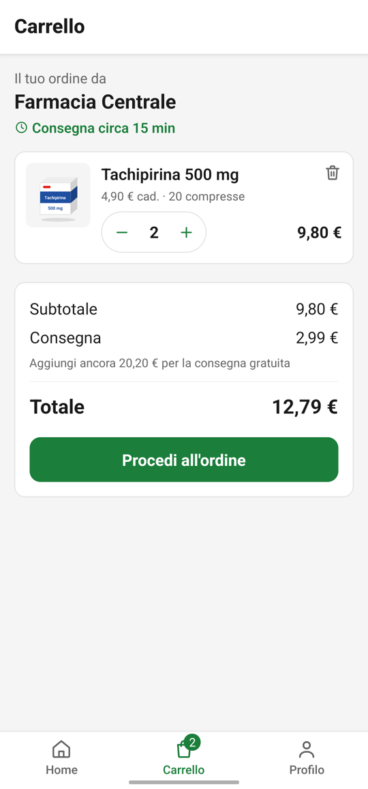
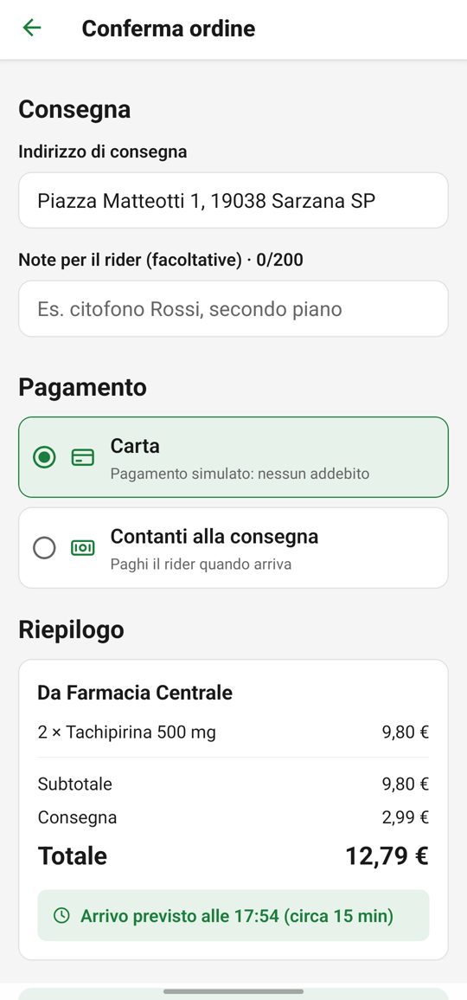
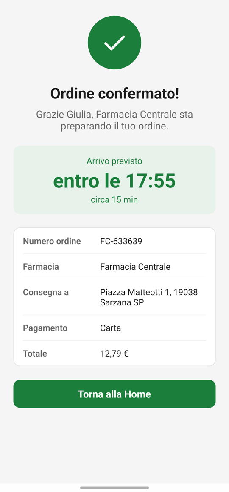
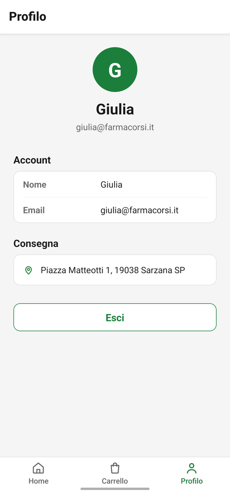

<p align="center">
  
</p>

<h1 align="center">FarmaCorsi</h1>

<p align="center">
  App mobile per ordinare prodotti da farmacia con consegna a domicilio.<br>
  Progetto per l'UF16 "React Native" dell'ITS Prodigi.
</p>

---

L'utente cerca un prodotto, vede quali farmacie ce l'hanno ordinate per
distanza, con prezzo e tempo di consegna, lo mette nel carrello e conferma
l'ordine. Il funzionamento è simile a Deliveroo o Glovo.

Sono disponibili solo prodotti senza obbligo di ricetta (OTC/SOP) e
parafarmacia. I dati sono finti e il pagamento è simulato.

## Funzionalità

- **Login** con utenti di prova, validazione dei campi e sessione salvata:
  riaprendo l'app si entra direttamente. La password non viene mai salvata.
- **Home** con saluto in base all'ora, barra di ricerca, categorie,
  prodotti più cercati e farmacie vicine.
- **Ricerca** per nome o marca (senza badare a maiuscole e accenti) oppure
  per categoria.
- **Pagina prodotto** con illustrazione, specifiche, farmacie ordinate per
  distanza, scelta della farmacia e della quantità.
- **Carrello** globale con badge sulla tab, salvato sul telefono:
  - una sola farmacia per ordine;
  - consegna gratuita sopra i 30 €.
- **Checkout** con indirizzo di consegna, note per il rider, pagamento
  simulato (carta o contanti) e conferma con numero d'ordine.
- **Profilo** con i dati dell'utente e uscita con conferma.

## Screenshot

Schermate reali, catturate su un Samsung Galaxy A32.

| Login | Home | Ricerca |
|:---:|:---:|:---:|
|  |  |  |

| Pagina prodotto | Scelta farmacia e quantità | Carrello |
|:---:|:---:|:---:|
|  |  |  |

| Checkout | Ordine confermato | Profilo |
|:---:|:---:|:---:|
|  |  |  |

## Tecnologie

| Cosa | Scelta |
|---|---|
| Framework | React Native 0.87 (CLI, senza Expo) + TypeScript |
| Navigazione | React Navigation 7: stack nativo e tab in basso |
| Persistenza locale | AsyncStorage (sessione e carrello) |
| Grafica | `StyleSheet` di React Native; icone e illustrazioni SVG con `react-native-svg` |
| Test | Jest + react-test-renderer |

Non usa librerie di componenti grafici: colori, spaziature e dimensioni del
testo sono definiti in `src/tema/`.

## Avvio

### Requisiti

| Strumento | Versione | Note |
|---|---|---|
| Node.js | 22.11 o superiore | indicato in `package.json` (`engines`) |
| JDK | 17 | ad esempio Zulu o Temurin 17 |
| Android SDK | platform 36 e 37, build-tools 37.0.0 | si installano da Android Studio (SDK Manager) |
| Android NDK | 27.1.12297006 | Android Studio lo scarica alla prima compilazione se manca |
| Gradle | 9.4.1 | non va installato: lo scarica `./gradlew` |

Variabili d'ambiente (macOS, ad esempio in `~/.zshrc`):

```sh
export ANDROID_HOME=$HOME/Library/Android/sdk
export PATH=$PATH:$ANDROID_HOME/emulator:$ANDROID_HOME/platform-tools
```

La procedura completa, anche per Windows e Linux, è nella
[guida ufficiale di React Native](https://reactnative.dev/docs/set-up-your-environment)
(scegliere "React Native CLI", sistema operativo e "Android").

Per provare l'app serve un telefono Android con le **Opzioni sviluppatore** e
il **Debug USB** attivi (Impostazioni → Info telefono → toccare 7 volte
"Numero build"), oppure un emulatore creato da Android Studio.

### Installazione

```sh
git clone https://github.com/Dieeegooo/FarmaCorsi.git
cd FarmaCorsi
npm install
```

### Esecuzione su telefono Android

```sh
adb devices                       # il telefono deve comparire come "device"
adb reverse tcp:8081 tcp:8081     # collega il telefono a Metro
npm start                         # avvia Metro (lasciarlo aperto)
npm run android                   # in un secondo terminale: compila e installa
```

La prima compilazione richiede qualche minuto. Con Metro aperto, premi `r`
nel terminale per ricaricare l'app dopo una modifica al codice. Dopo aver
aggiunto una libreria con codice nativo va rilanciato `npm run android`.

Senza cavo, dal telefono si può usare il **Debug wireless** (Android 11+):
Opzioni sviluppatore → Debug wireless → "Associa dispositivo con codice", poi

```sh
adb pair <ip>:<porta-associazione>    # inserire il codice mostrato sul telefono
adb connect <ip>:<porta>
```

Android è la piattaforma principale. iOS non è stato testato.

### Utenti di prova

| Email | Password |
|---|---|
| `diego@farmacorsi.it` | `password123` |
| `giulia@farmacorsi.it` | `password123` |

## Comandi

| Comando | A cosa serve |
|---|---|
| `npm start` | Avvia Metro |
| `npm run android` | Compila e installa l'app sul telefono |
| `npx tsc --noEmit` | Controllo dei tipi TypeScript |
| `npm run lint` | Controllo del codice con ESLint |
| `npm test` | Esegue i test Jest |

## Struttura del progetto

```
src/
├── componenti/     componenti riutilizzabili (SchedaProdotto, CampoTesto, Pulsante...)
├── contesti/       stato globale: utente e carrello (Context, useReducer)
├── dati/           dati finti: farmacie, prodotti, disponibilità, utenti
├── icone/          icone SVG, un componente per icona
├── navigazione/    stack principale, tab, stack della Home e tipi delle rotte
├── schermate/      Login, Home, RisultatiRicerca, DettaglioProdotto,
│                   Carrello, Checkout, OrdineConfermato, Profilo
├── servizi/        funzioni asincrone che leggono i dati: unico punto da
│                   cambiare quando arriverà un'API vera
├── tema/           colori, spaziature, dimensioni del testo
├── tipi/           tipi TypeScript condivisi (Prodotto, Farmacia, Ordine...)
└── utilita/        calcoli puri: distanza, consegna, prezzi, saluto, validazione
__tests__/          test unitari e di integrazione
docs/               specifica (SPEC.md), logo dell'app e screenshot
```

### Come sono collegati i livelli

```
schermate  →  componenti / icone
    ↓
contesti   (utente, carrello)
    ↓
servizi    (funzioni async, come un'API)
    ↓
dati       (finti)
```

Le schermate non importano mai direttamente da `src/dati/`: passano sempre da
`src/servizi/`. Per collegare un backend vero basterà riscrivere l'interno dei
servizi, senza toccare schermate e componenti.

## Regole di calcolo

- **Posizione dell'utente:** simulata, al centro di Sarzana (44.1113, 9.9596).
- **Distanza:** in linea d'aria, con la formula di Haversine.
- **Tempo di consegna:** 15 minuti + 4 minuti per km, arrotondato ai 5 minuti.
- **Costo di consegna:** 2,99 €, gratis da 30 € di subtotale.
- **Prezzi:** sempre con due decimali e la virgola (es. "4,90 €").

## Test

```sh
npm test
```

I test coprono:

- **funzioni di calcolo:** saluto, distanza, consegna, prezzi, ricerca,
  validazione;
- **servizi:** login, sessione (compreso il controllo che la password non venga
  salvata), prodotti, farmacie, ordini;
- **carrello:** il reducer;
- **flussi completi**, montando l'app intera:
  - ingresso in Home con la sessione salvata;
  - ordine dal carrello alla conferma;
  - logout;
  - ritorno alla Home dalle tab.

## Documentazione

- [`docs/SPEC.md`](docs/SPEC.md): specifica dell'MVP (schermate, regole,
  modelli dati).
- [`CLAUDE.md`](CLAUDE.md): convenzioni del progetto: tutto in italiano,
  niente emoji, stili solo dal tema, un componente per file.

## Problemi comuni

| Problema | Soluzione |
|---|---|
| Schermo rosso "Unable to load script" | Metro non è raggiungibile: controlla che `npm start` sia aperto e rilancia `adb reverse tcp:8081 tcp:8081` |
| `adb devices` non mostra il telefono o dice `unauthorized` | Ricollega il cavo e accetta sul telefono la richiesta "Consenti debug USB" |
| Porta 8081 già occupata | Chiudi l'altro Metro oppure avvia con `npm start -- --port 8082` e usa `adb reverse tcp:8082 tcp:8082` |
| `SDK location not found` | Manca `ANDROID_HOME`: vedi "Requisiti", oppure crea `android/local.properties` con `sdk.dir=/percorso/Android/sdk` |
| Errori strani dopo aver cambiato dipendenze | `npm start -- --reset-cache`; per la parte Android `cd android && ./gradlew clean` |
| L'icona dell'app non si aggiorna | Disinstalla l'app dal telefono e rilancia `npm run android` |

## Fuori dall'MVP

Idee per le prossime versioni:

- backend vero al posto dei dati finti;
- posizione GPS reale;
- mappa delle farmacie e tracking del rider;
- registrazione e storico degli ordini.

## Riferimenti

Documentazione usata per sviluppare il progetto:

- [React Native: documentazione](https://reactnative.dev/docs/getting-started),
  in particolare [componenti di base](https://reactnative.dev/docs/components-and-apis),
  [FlatList](https://reactnative.dev/docs/flatlist) e
  [StyleSheet e Flexbox](https://reactnative.dev/docs/flexbox)
- [React: hook](https://react.dev/reference/react/hooks):
  [useState](https://react.dev/reference/react/useState),
  [useEffect](https://react.dev/reference/react/useEffect),
  [useContext](https://react.dev/reference/react/useContext),
  [useReducer](https://react.dev/reference/react/useReducer)
- [React Navigation 7](https://reactnavigation.org/docs/getting-started):
  [stack nativo](https://reactnavigation.org/docs/native-stack-navigator),
  [tab in basso](https://reactnavigation.org/docs/bottom-tab-navigator),
  [navigatori annidati](https://reactnavigation.org/docs/nesting-navigators),
  [flusso di autenticazione](https://reactnavigation.org/docs/auth-flow),
  [TypeScript](https://reactnavigation.org/docs/typescript)
- [AsyncStorage](https://github.com/react-native-async-storage/async-storage)
- [react-native-svg](https://github.com/software-mansion/react-native-svg)
- [TypeScript Handbook](https://www.typescriptlang.org/docs/handbook/intro.html)
- [Jest](https://jestjs.io/docs/getting-started) e
  [test in React Native](https://reactnative.dev/docs/testing-overview)
- [Formula di Haversine](https://it.wikipedia.org/wiki/Formula_dell%27emisenoverso)
  per la distanza tra due coordinate
- [Conventional Commits](https://www.conventionalcommits.org/it/v1.0.0/)
  per i messaggi di commit

## Autore

Diego Barbagallo, ITS Prodigi, UF16 React Native.
